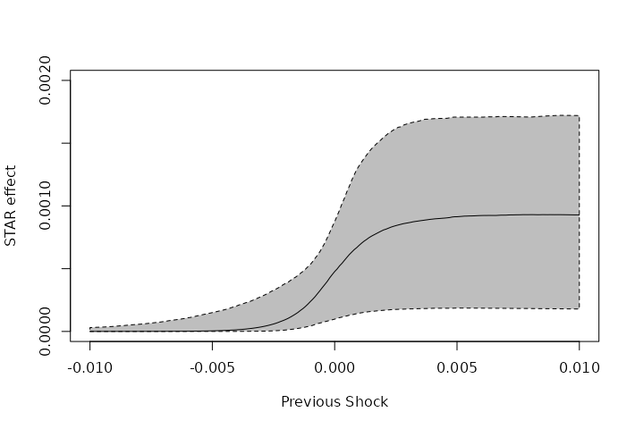

---
output:
  html_document: default
  pdf_document: default
---



In this series we are trying to reproduce the models and examples listed in the book "Analysis of Financial Time Series, 3rd Edition", by Ruey S. Tsay, using Stan <https://mc-stan.org/> and the package RStan <https://cran.r-project.org/web/packages/rstan/index.html>. The main repository for the presented models and data can be found at <https://github.com/marcomarconi/AFTS_with_Stan>.

```{r setup, include=FALSE,echo=FALSE}
require(knitr)
knitr::opts_chunk$set(echo = TRUE)
read_chunk('common.R')
read_chunk('Chapter_4.R')
knitr::opts_knit$set(root.dir = rprojroot::find_rstudio_root_file())

```

```{r load_packages,   message=FALSE}
```

## The Threshold Autoregressive (TAR) model

In a TAR model, AR models are estimated separately in two or more piecewise values as defined by the dependent variable. The two (or more) AR model are modelled based on a threshold value (or another condition). In general, there will be different AR models depending on whether the value of interested exceeds or not the predefined threshold.These AR models may or may not be of the same order.

### Example 4.3

We are going to use the daily log returns, in percentage and including dividends, of IBM stock from July 3, 1962, to December 31, 2003, for 10,446 observations.

```{r load_4.3}
```

We are going to fit to the data 3 models: AR(2)--GARCH(1,1), TGARCH and AR(2)-TAR-GARCH(1,1).

The AR(2)-TAR-GARCH(1,1) can be coded in Stan as follows:

```{stan code=readLines("../models/Chapter_4/AR-TAR-GARCH.stan"),  output.var='priors', eval = FALSE, tidy = FALSE}

```

For simplicity, the AR(2)-TAR-GARCH(1,1) will be fitted with the variational inference algorithm, as MCMC sampling takes a long time (here we are also loading pre-fitted models as it takes a long time to build this Markdown document):

```{r fit_4.3, cache=TRUE, message=FALSE, warning=FALSE}
```

In the book Tsay notices that the AR(2)-TAR-GARCH(1,1) produces an unconditional mean much closer to the sample mean of 0.039 compared to the other two models, meaning that this non-linear model is able to capture the asymmetric behavior in daily IBM stock volatility while still being able to retain the returns mean value:

```{r means_4.3}
```

## Smooth Transition AR (STAR) model

The main problem with TAR model is that steep discontinuity points between different mean regimes are sometimes hard to explain in practice. In response, the STAR model was proposed, which models the transition using some smooth sigmoid function (usually logistic, see formula (4.15) in the book). A possible implementation of the STAR model in Stan could look as follows. Notice the requirement for a mean and scale prior for the scale paramter of the logistic funcion (gamma2). This parameter is usually hard to identify, even with large amount of data:

```{stan code=readLines("../models/Chapter_4/STAR.stan"),  output.var='priors', eval = FALSE, tidy = FALSE}

```

### Example 4.4

Let's fit the STAR model to the monthly simple stock returns for Minnesota Mining and Manufacturing (3M) Company from February 1946 to December 2008, together with regular ARCH(2) model:

```{r fit_4.4, message=FALSE, warning=FALSE}

```

Notice how the gamma2 posterior is practically unaffected by the data. The logistic parameters seem to be significantly different from zero, suggesting a substantial asymmetry in volatility response to positive/negative shocks. Tsay suggests that for large positive shocks the ARCH effects in the STAR model are weak, and stronger for large negative shocks.

We can appreciate the consequence of the uncertainty in parameter estimation by plotting the implied curve for the logistic function:

```{r curve_4.4}
```

A comparison between ARCH and STAR seems to favor the second:

```{r loo_4.4}
```

## Markov Switching Autoregressive models

We can also model the transition between different regimes by assuming the existence of two underlying discrete hidden states and that the observed data is the result of the probabilistic transition between these two states. The idea is similar to hidden markov models and has been proposed by Hamilton (1989). This kind of model has already been implemented by Jim Savage <http://modernstatisticalworkflow.blogspot.com/2018/02/regime-switching-models-in-stan.html> so we are going to use a modified version of its code:

```{stan code=readLines("../models/Chapter_4/MSA.stan"),  output.var='priors', eval = FALSE, tidy = FALSE}

```

Fitting this model to the data result is parameters estimation vaguely similar to Tsay, even if the autoregressive coefficients are quite different. Notice that the probability to stay in a state of positive growth is higher that the probability to stay in a state of negative growth, indicating that it is more likely for the U.S. GNP to get out of a contraction period than to jump into one:

```{r fit_4.5, message=FALSE, warning=FALSE}

```

We can look at the mean growth rate of the two states, notice that the state corresponding to negative growth rates display large uncertainty, due to less observations:

```{r plot_m_4.5}

```

The expected duration of the two states are quite different from Tsay (he estimated 11.31 quarters for the positive state and 3.69 for the negative state):

```{r plot_w_4.5}

```

Finally, we can also observe the probability of each state along the whole period:

```{r plot_s_4.5}

```
