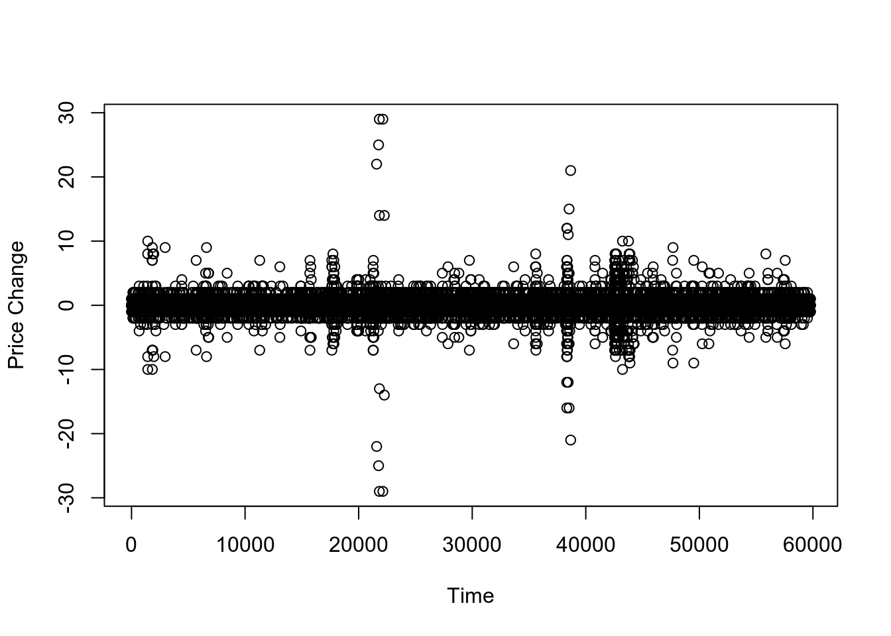

---
output:
  html_document: default
  pdf_document: default
---

```{r setup, include=FALSE,echo=FALSE}
require(knitr)
knitr::opts_chunk$set(echo = TRUE)
read_chunk('common.R')
read_chunk('Chapter_5.R')
knitr::opts_knit$set(root.dir = rprojroot::find_rstudio_root_file())

```

{width="672"}

In this series we are trying to reproduce the models and examples listed in the book "Analysis of Financial Time Series, 3rd Edition", by Ruey S. Tsay, using Stan <https://mc-stan.org/> and the package RStan <https://cran.r-project.org/web/packages/rstan/index.html>. The main repository for the presented models and data can be found at <https://github.com/marcomarconi/AFTS_with_Stan>.

```{r load_packages,   message=FALSE}
```

## 5.4 Models for Price Change - Decomposition Model

When analyzing high frequency intraday data it is common to encounter long periods of "no change" in price data. In order to account for this phenomenon we are going to see the ADS Decomposition model. In this model price change is decomposed into three components: indicator for price change, the direction of price movement if there is a change, and the size of price change if a change occurs. Specifically, the price change at the *i*th transaction can be written as:

$$ 
y_i = P_{t_i} - P_{t_i-1} = A_iD_iS_i
$$

Where *A~i~* is binary variable that takes the value of 0 if there is a price change at the *i*th trade and 1 otherwise. *D~i~* is also a discrete variable conditional on *A~i~* that takes the value of 1 if the price has increase or -1 if the price has decreased. *S~i~* is the size of the price change in ticks if there is a change at the *i*th trade and *S~i~* = 0 if there is no price change at the *i*th trade. Let's look at the Stan code, notice that the model can be formulated in both ways presented in the book (we are going to use the analytical likelihood specified in the book at formula (5.29)):

```{stan code=readLines("../models/Chapter_5/ADS.stan"),  output.var='priors', eval = FALSE, tidy = FALSE}

```

We illustrate the decomposition model by analyzing the intraday transactions of IBM stock from November 1, 1990, to January 31, 1991. There were 63 trading days and 59,838 intraday transactions in the normal trading hours:

```{r load_5.2}
```

Let's fit the ADS model to the data:

``` {.R}
ADS <- stan_model("models/Chapter_5/ADS.stan")
fit_ADS <- sampling(ADS, data = list(N = length(ibm91_ads$A), A=ibm91_ads$A, D=ibm91_ads$D, S=ibm91_ads$S), chains = 4, cores = 4, iter=2000)
```

As you can see, the parameters recovered by Stan as almost the same as the ones showed in the book (it's no surprise, we used the exact same analytic likelihood):

```{r fit_5.2, message=FALSE, warning=FALSE, echo=FALSE}
```

```{r print_5.2, message=FALSE, warning=FALSE}
```

The model estimation allows us to determine many interesting features. For example, we can calculate the probability of a price change depends on whether there was a previous price change:

```{r plot_A_5.2, message=FALSE, warning=FALSE}
```

This plot shows that price change may occur in clusters and, as expected, most transactions are without price change.

Moreover, we can see that

-   there is no preference for price increase or decrease after no price change (red line). So little margin for price change prediction.

-   Consecutive price increases or decreases are very low (blue line).

-   There is evidence of bid-ask spread bounce, as there is high chance of price increase after a price decrease (green line).

```{r plot_D_5.2, message=FALSE, warning=FALSE}
```

Finally, we can see that there is weak evidence suggesting that big price changes have a higher probability to be followed by another big price change:

```{r plot_S_5.2, message=FALSE, warning=FALSE}
```

## 5.5 DURATION MODELS

Duration models address the problem of time intervals between trades. Longer time periods between transactions indicate lack of trading activities, meaning that no information can be retrieved during these periods.

### ACD Model

The ACD model can be viewed as an adaptation of GARCH to time durations:

$$
x_i = \psi_i \epsilon_i \\
\psi_i = \omega + \sum_{j=1}^{r} \gamma_i x_{i-j} + \sum_{j=1}^{s} \omega_i \psi_{i-j}
$$
where *x~i~* is the time elapsed between to consecutive transactions. The error term *\epsilon~i~* can be modelled with an exponential distribution (EACD), Weibull (WACD) or gamma (GACD). \
The ACD model can be coded in Stan as follows:

```{stan code=readLines("../models/Chapter_5/ACD.stan"),  output.var='priors', eval = FALSE, tidy = FALSE}
```

Let's apply the WACD to the IBM stock transaction durations on five consecutive trading days from November 1 to November 7, 1990:

```{r load_5.3, message=FALSE, warning=FALSE, fig.width = 10, fig.height= 3}
```

```{r fit_5.3, message=FALSE, warning=FALSE, echo=FALSE}
```
``` {.R}
ACD <- stan_model("models/Chapter_5/ACD.stan")
fit_ACD_ibm <- sampling(ACD, data = list(N = length(ibm), y=ibm, family=0, psi1=1, M=0, m=vector()), chains = 4, cores = 4, iter=1000, control=list(adapt_delta=0.9))
```

```{r print_5.3, message=FALSE, warning=FALSE}
```

The parameters recovered are very similar to Tsay's. \
We can also see that the standardized innovations do not show any sign of serial dependence, confirming the adequacy of the model:

```{r plot_5.3, message=FALSE, warning=FALSE}
```

## 5.6 NONLINEAR DURATION MODELS

We apply Tsay’s test for nonlinearity on the residuals from the WACD model discussed before. This test against the null hypothesis that the time series follows some AR process, we see that the test suggests the presence of non-linearity:

```{r test_1_5.4, message=FALSE, warning=FALSE}
```

We therefore fit a threshold WACD model to the data (see the file TAR-ACD.stan to see the implementation in Stan), assuming two regimes with a threshold of 3.79:

```{r fit_5.4, message=FALSE, warning=FALSE}
```
``` {.R}
TARACD <- stan_model("models/Chapter_5/TAR-ACD.stan")
fit_TARACD_ibm <- sampling(TARACD, data = list(N = length(ibm), y=ibm, threshold=3.79, psi1=1, M=0, m=vector()), chains = 4, cores = 4, iter=1000, control=list(adapt_delta=0.90))

```


We can see that parameters estimation is similar to Tsay, and that the non-linearity in the residuals is removed. Moreover, loo comparison seems to strongly prefer the non-linear model:

```{r print_5.4, message=FALSE, warning=FALSE}
```
```{r test_2_5.4, message=FALSE, warning=FALSE}
```

## 5.7 BIVARIATE MODELS FOR PRICE CHANGE AND DURATION

We now introduce a combined model for both price change and transaction duration. The PCD model focus on transactions that result in price change. According to this model and the notation described before, stock prices evolve over time as:

$$
P_{t_i} = P_{t_i-1} + D_iS_i
$$
The PCD model can be coded in Stan as follows:

```{stan code=readLines("../models/Chapter_5/PCD.stan"),  output.var='priors', eval = FALSE, tidy = FALSE}
```

Let's fit it intraday transactions of IBM stock on November 21, 1990. There are 194 price changes within normal trading hours. Tsay needed to implement a Gibbs sampler with 9500 iterations, in Stan we get it for free and with only 100 iterations:


```{r load_5.5, message=FALSE, warning=FALSE}
```

```{r fit_5.5, message=FALSE, warning=FALSE, echo=FALSE}
```
``` {.R}
PCD <- stan_model("models/Chapter_5/PCD.stan")
fit_PCD<- sampling(PCD, data = list(T = nrow(day15), log_dt=log(day15$TT), D=day15$D, S=day15$S, N=day15$N), chains = 4, cores = 4, iter=1000, control=list(adapt_delta=0.90))
```
```{r print_5.5, message=FALSE, warning=FALSE}
```

We can see that parameter estimation is pretty close to Tsay.
