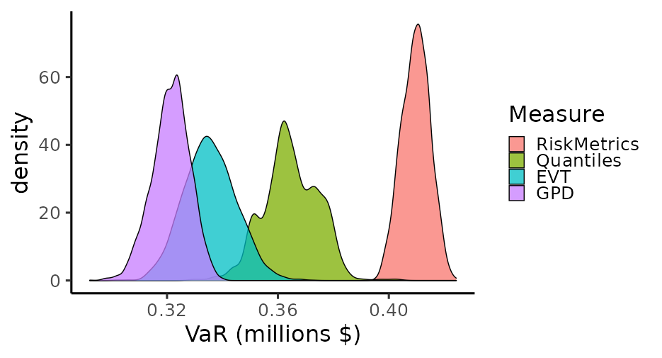

---
output:
  html_document: default
  pdf_document: default
---



```{r setup, include=FALSE,echo=FALSE}
require(knitr)
knitr::opts_chunk$set(echo = TRUE,fig.width=12,fig.height=7)
read_chunk('common.R')
read_chunk('Chapter_7.R')
knitr::opts_knit$set(root.dir = rprojroot::find_rstudio_root_file())

```

In this series we are trying to reproduce the models and examples listed in the book "Analysis of Financial Time Series, 3rd Edition", by Ruey S. Tsay, using Stan <https://mc-stan.org/> and the package RStan <https://cran.r-project.org/web/packages/rstan/index.html>. The main repository for the presented models and data can be found at <https://github.com/marcomarconi/AFTS_with_Stan>.

```{r load_packages,   message=FALSE}
```

## 7.1 VALUE AT RISK

The Value at Risk (VaR) is a point estimate of potential financial loss, it tries to foresee the potential loss of a holding position due to adverse market movements during a certain period. VaR is commonly used to ensure that a financial institution is still in business even after a catastrophic event. VaR is usually defined as the upper quantile of a loss function *L* over a time period *h*. The Var define the amount of value we are risking over a certain time horizon given a determined probability. The Var therefore requires a predictive distribution of future returns of the financial position. For most of the models described in the previous posts the *h* steps ahead forecast is easily available, and so is the VaR. The first approach to VaR calculation we are going to see is the RiskMetrics methodology developed at J.P. Morgan in 1995. In its simple form, RiskMetrics assumes that the continuously compounded daily return of a portfolio follows a conditional normal distribution.In its simple form, RiskMetrics assumes that the continuously compounded daily return of a portfolio follows a conditional normal distribution. This simple formulation can be applied to most of the models described in previous posts. Consider the IGARCH model applied to the IBM log returns seen in post about Chapter 3 (GARCHs models):

```{r load_7.2, message=FALSE, warning=FALSE}
```

``` {.R}
IGARCH <- stan_model("models/Chapter_3/IGARCH.stan")
fit_ibm <- sampling(IGARCH, data = list(N = length(ibm$rtn), y=ibm$rtn, sigma1=sd(ibm$rtn)), chains = 4, cores = 4, iter=500)
```

```{r fit_7.2, message=FALSE, warning=FALSE, echo=FALSE}
```

```{r print_7.2, message=FALSE, warning=FALSE}
```

We can easily calculate the VaR at 5% and 1% threshold. Noticed that in the bayesian context we can easily get uncertainty about VaR estimation:

```{r plot_7.2, message=FALSE, warning=FALSE}
```

## 7.5 EXTREME VALUE THEORY

Extreme value theory concerns with the study of extraordinary events, for example extreme deviations from the median of some probability distribution. In case of financial prices we are going to analyze the tail behavior of returns distribution. One approach is to observe the distribution of the maximums and minimums of returns. However, for a given sample, there is only a single minimum or maximum. One simple idea is to split the dataset into subsample and get maximum and minimum of each subsample. In the case of stock prices the size of each subsample is generally guided by practical considerations (e.g. we have 21 trading days in a month). Maxima and minima tend to follow extreme value distributions, like the generalized extreme value distribution (GEV). We can model the GEV in Stan as follows:

```{stan code=readLines("../models/Chapter_7/GEV.stan"),  output.var='priors', eval = FALSE, tidy = FALSE}

```

Let's apply the GEV to the IBM prices seem before. We are going to use 21 as subperiod, as extract the extreme maxima and minima:

```{r load_7.5.3, message=FALSE, warning=FALSE}
```

Now we can estimate the parameters of the generalized extreme value distribution for IBM daily log returns:

```{r fit_7.5.3, message=FALSE, warning=FALSE}
```

The $\xi$ parameter is significantly positive, meaning that daily log return may have a heavier left tail (it follows the Fréchet family). This means that the common normality assumptions for the daily log returns is not adequate. We can also observe the residuals of the GEV and check that they follow an exponential distribution:

```{r residuals_7.5.3, message=FALSE, warning=FALSE}
```

## 7.6 EXTREME VALUE APPROACH TO VAR

The previously describe extreme value approach can be used to calculate the VaR. After estimating the parameters of the GEV, the VaR of a financial position given a small upper probability *p* is:

```{=tex}
\begin{equation}
VaR =
\begin{cases}

        \mu - \sigma/\xi \{1- [-n\ln(1-p)  ]^{-\xi} \} & \text{if } \xi \neq 0 \\
         \mu - \sigma/\xi \ln[-n\ln(1-p)  ] & \text{if } \xi = 0 
\end{cases}
\end{equation}
```
Let's compare this VaR calculation based on extreme value theory with the previous one from RiskMetrics. We also include an empirical estimation based on resampling of the quantiles from the returns distribution (see section 7.4 of the book):

```{r var_7.5.3, message=FALSE, warning=FALSE}
```

Curiously, the EVT estimation is the lowest one. According to Tsay, "VaR obtained here via the traditional extreme value theory may not be adequate because the independent assumption of daily log returns is often rejected by statistical testings. Finally, the use of sub-period maxima overlooks the fact of volatility clustering in the daily log returns".

## 7.7 NEW APPROACH BASED ON THE EXTREME VALUE THEORY

Instead of subdividing the sample into *n* subperiods and taking the maxima/minima we can select the events whose returns exceed some threshold value. This "extreme" returns can be then fitted to a generalized pareto distribution (GPD), out of which we can infer a VaR.\
The GPD can be modeled in Stan as follows:

```{stan code=readLines("../models/Chapter_7/GPD.stan"),  output.var='priors', eval = FALSE, tidy = FALSE}
```

Let's extract the extreme event above the 3% threshold and fit them:

```{r fit_7.7.4, message=FALSE, warning=FALSE}
```

We can now extract the corresponding VaR and compare it to the previous ones. I am using formula (7.36) in the book to calculate the VaR from a GPD. Notice that the parametrization that we use do not include the location parameter $\beta$, therefore I am using the sample mean as an approximation. The alternative parametrization is discussed in the book at section "7.7.5 Alternative Parameterization":

```{r var_7.7.4, message=FALSE, warning=FALSE}
```

It looks like that the GPD in this situation returns the most conservative estimation.
